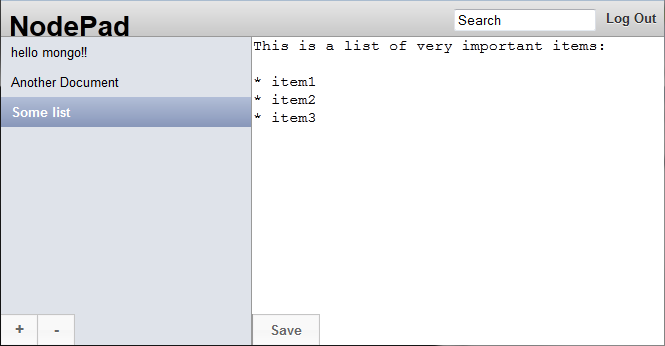

yaap-nodepad
============

a more complex yaap/express example of a note-webapplication

based on http://dailyjs.com/2010/11/01/node-tutorial/

uses wire.js, express.js, yaap/wire and yaap/wire/express

#features:
 * mongodb as backend
 * user authentification
 * simple rest-api
 * MVC-approach

#Screenshot
